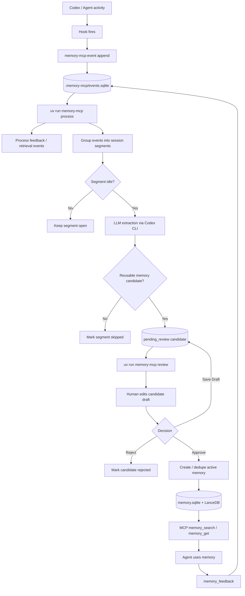

# Memory MCP Flow

```mermaid
flowchart TD
    A[Codex / Agent activity] --> B[Hook fires]
    B --> C[memory-mcp-event append]
    C --> D[(.memory-mcp/events.sqlite)]

    D --> E[uv run memory-mcp process]

    E --> F[Process feedback / retrieval events]
    E --> G[Group events into session segments]
    G --> H{Segment idle?}

    H -- No --> I[Keep segment open]
    H -- Yes --> J[LLM extraction via Codex CLI]

    J --> K{Reusable memory candidate?}
    K -- No --> L[Mark segment skipped]
    K -- Yes --> M[(pending_review candidate)]

    M --> N[uv run memory-mcp review]
    N --> O[Human edits candidate draft]
    O --> P{Decision}

    P -- Save Draft --> M
    P -- Reject --> Q[Mark candidate rejected]
    P -- Approve --> R[Create / dedupe active memory]

    R --> S[(memory.sqlite + LanceDB)]
    S --> T[MCP memory_search / memory_get]
    T --> U[Agent uses memory]
    U --> V[memory_feedback]
    V --> D
```
