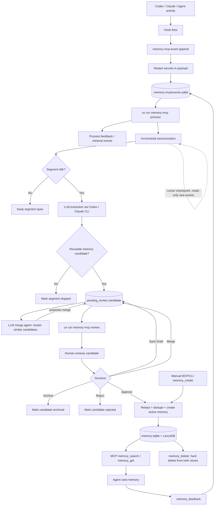

# Memory MCP Flow

End-to-end view of how agent activity becomes reusable, human-reviewed memory,
and how that memory is retrieved and maintained. File/function references point
at the implementation so this doubles as an architecture map.

## Data stores

Everything lives under `.memory-mcp/`. There are two independent SQLite
databases plus one vector store; each checkpoint sits in the database whose rows
it guards (SQLite cannot wrap a transaction across two files).

| Store | Owner | Tables | Holds |
|---|---|---|---|
| `events.sqlite` | `EventStore` (`core/events.py`) | `events`, `session_segments`, `memory_candidates`, `checkpoints` | raw capture and the extraction pipeline |
| `memory.sqlite` | `LocalMemoryStore` (`core/store.py`) | `memories`, `feedback_events`, `checkpoints` | curated memories and feedback log |
| `lancedb/` | LanceDB | `memories` vector table | one embedding per memory for search and dedupe |

## Stage 1 — Capture and ingestion

1. **Agent activity → hook.** Codex/Claude lifecycle events fire hooks
   (`UserPromptSubmit → user_prompt`, `PostToolUse → tool_result`,
   `Stop → turn_stop`).
2. **`memory-mcp-event append`** (`hooks/cli.py`) reads the hook payload from
   stdin or `--payload`.
3. **Adapter normalization** (`adapters/`, one of `codex` / `claude` /
   `generic`) maps the agent-specific payload into the shared event contract:
   `event_type`, `source`, `project`, `session_id`, `run_id`, `payload`,
   `created_at`. Explicit `--project/--session-id/--run-id` flags win over
   adapter-derived values; a stable `<source>:<project>` fallback is used when no
   session id is present.
4. **Redaction (M11).** `EventStore.append_event` runs `redact_payload`
   (`core/redaction.py`) before the row is written, so secrets never land in
   `events.sqlite`. Redaction combines key-based scrubbing (sensitive dict keys
   like `password`, `token`, `api_key`, `authorization`) with pattern-based
   scrubbing (PEM private keys, bearer tokens, OpenAI/GitHub/AWS/Slack token
   shapes, inline `key=value`); matches become `[REDACTED]`.

Hooks and the append CLI do not dedupe; every event is recorded.

## Stage 2 — The process pipeline

`uv run memory-mcp process` (`operator.py`) runs four workers in order, each a
short-lived, run-and-exit step (no daemon):

### 2.1 EventWorker (`pipeline/workers/event_worker.py`)
Consumes unprocessed events via `list_unprocessed` and applies the two pipeline
event types: `memory_feedback` (score rules + counters) and `memory_retrieved`
(weak retrieval signal). Each event row is stamped `processed_at`, or
`failed_at` + `error` on failure. This is per-row marking, distinct from the
sessionization cursor below.

### 2.2 SessionWorker — incremental CDC sessionization (M12)
Groups events into per-session time segments, incrementally.

- **Cursor checkpoint.** A single high-water mark `(last_event_created_at,
  last_event_id)` is stored under `checkpoints['session_worker']` in
  `events.sqlite`. The event id is the tie-breaker for equal timestamps.
- **First run (no checkpoint) → backfill.** Runs the full-scan `_build_segments`
  oracle and sets the cursor to the high-water mark. This auto-migrates existing
  stores.
- **Steady state → incremental.** `list_events_after(cursor)` reads only newer
  events in batches. A per-batch `dict[(project, session_id) → segment]` is
  seeded lazily from the latest stored segment, mutated in memory, then flushed.
- **Extend vs. split.** A new event extends the session's open segment unless:
  the session is new, the gap exceeds `max_segment_gap`, or the predecessor
  segment is terminal — in which case a new segment (index + 1) opens. (A late
  event after an extracted segment thus starts a fresh segment instead of being
  dropped.)
- **Crash safety.** Each batch flushes its segment writes plus the cursor advance
  in one `EventStore.transaction()`, so an interrupted run replays cleanly with
  no double-counting.
- **Idle marking.** `mark_open_segments_idle(now - idle_after)` is a targeted
  `UPDATE` on the `(status, last_event_at)` index — it never scans event
  payloads — so quiescent sessions become `idle` without a full rescan.
- **Repair.** `memory-mcp rebuild-sessions` clears non-terminal segments, replays
  via the full scan, and resets the cursor; it keeps terminal segments for audit
  and is the escape hatch for out-of-order events.

Segment id is `sha256(project, session_id, segment_index)`. Session statuses:
`open`, `idle`, `processed`, `skipped`, `failed`.

### 2.3 ExtractionWorker (`pipeline/workers/extraction_worker.py`)
Turns `idle` segments into candidates. For each segment it loads the segment's
events and calls `extractor.extract(segment, events)`:

- **Extractors** (`pipeline/extractors.py`): `CodexCliExtractor` /
  `ClaudeCliExtractor` run the CLI non-interactively with a JSON output schema
  (`ExtractionResult`); `StaticMemoryExtractor` is used in tests. Extraction runs
  outside the project dir by default so project hooks are not re-triggered
  (`--project-context` opts in).
- **Categories**: `clue_location`, `external_context`, `user_correction`,
  `durable_workflow`, `repeated_pitfall`.
- **Outcome**: candidates written as `pending_review` (segment → `processed`);
  no candidate → `skipped` with a reason; exception → `failed`. Evidence event
  ids are validated to belong to the segment. Extraction only ever writes
  candidates — never active memories.

### 2.4 DecayWorker (`pipeline/workers/decay_worker.py`)
Applies `score *= 0.995` once per elapsed day to active memories, guarded by
`checkpoints['daily_decay_date']` in `memory.sqlite` so repeated runs in a day
are idempotent. Disabled with `--no-decay`.

## Stage 3 — Candidate review and merge (M13)

Candidates are reviewed locally (`uv run memory-mcp review`, served by
`review/server.py` over `CandidateReviewService`). The state machine lives in
`CandidateWorker` (`pipeline/workers/candidate_worker.py`). Candidate statuses:
`pending_review`, `approved`, `rejected`, `merged`, `archived`.

Human actions on a `pending_review` candidate:

- **Edit / Save draft** — `update_candidate` (allowed only while pending).
- **Reject** — `reject_candidate` with a reason.
- **Archive** — `archive_candidate` hides it from the queue but retains it for
  audit (`status = archived`).
- **Merge** — `merge_candidates(source_ids, merged)`: combines ≥2 distinct
  pending candidates into one new editable `pending_review` candidate. Provenance
  is preserved — the union of `evidence_event_ids`, plus the set of source
  segment ids and source candidate ids in `metadata.merged_from`. Each source is
  marked `merged` with `merged_into_candidate_id` (reversible via
  `retry_candidate`).
- **Approve** — see Stage 4.

API surface: `POST /api/candidates/merge`, `POST /api/candidates/{id}/archive`,
plus the existing approve/reject/update/retry routes.

### LLM merge agent (`pipeline/workers/merge_proposal_worker.py`)
At volume, `MergeProposalWorker` automates the tedious part:

1. **Deterministic clustering** — single-linkage over pending candidates by
   shared category + lexical Jaccard overlap on situation/lesson/action (no LLM,
   no embedder).
2. **Proposal** — a `MergeProposer` (`Codex`/`Claude` CLI, same runner as the
   extractor; `StaticMergeProposer` in tests) returns a `MergeProposalResult`
   deciding `should_merge` and, if so, the merged content.
3. **Apply through the human gate** — on `should_merge`, it calls the same 13A
   `merge_candidates` primitive, producing a `pending_review` candidate. The
   agent **never creates an active memory**; a human still approves the result.

## Stage 4 — Approval, dedupe, and redaction

Approval (`CandidateWorker.approve_candidate`) and manual `memory_create`
(MCP tool / CLI) both flow through `LocalMemoryStore.create_memory`:

1. **Redact (M11).** `create_memory` scrubs `what_happened` / `when_useful` /
   `helpful_explanation` / `tags` before embedding or storage — closing the
   direct-write path that bypasses events.
2. **Embed.** Build `content_for_embedding` and embed it locally
   (`sentence-transformers/all-MiniLM-L6-v2`).
3. **Dedupe (no LLM).** `_find_dedupe_match` combines LanceDB vector similarity
   (thresholds 0.92 / 0.82) with token-Jaccard field overlap:
   - clear duplicate → merge metadata into the existing active memory;
   - possible duplicate → store the candidate as `rejected` with dedupe metadata
     for audit;
   - distinct → insert a new active memory + vector.

For an approved candidate, the candidate row is then linked to the created
memory (`approved_memory_id`) and set to `approved`, or to `rejected`/`merged`
to mirror the dedupe outcome.

## Stage 5 — Retrieval and feedback

- **Retrieval** — `memory_search` embeds the query, searches LanceDB, keeps only
  `active` memories matching tag/min-score filters, and ranks by
  `0.55*semantic + 0.25*score + 0.10*recency + 0.10*confidence`. Returned ids are
  recorded as a weak `retrieved` signal. `memory_get` fetches any memory by id
  (including non-active) for audit.
- **Feedback** — `memory_feedback` records a signal that adjusts score and may
  change status: `retrieved`/`used`/`helpful` are positive; `not_helpful` lowers
  score; `stale → stale`; `contradicted → superseded` (if a replacement id is
  given) else `stale`; `incorrect → invalid`. Every signal is appended to
  `feedback_events`, and MCP feedback is also logged as a `memory_feedback` event
  that re-enters the pipeline at Stage 2.1.

Memory statuses: `active`, `stale`, `superseded`, `invalid`, `rejected`,
`archived`. Only `active` memories are returned by search.

## Stage 6 — Deletion (M15)

`memory_delete` (MCP tool / CLI `memory-mcp delete`) hard-deletes a memory from
both `memory.sqlite` and the LanceDB vector table. It bypasses the audit
statuses above, so it is reserved for secret removal and explicit forget
requests; `record_feedback`/status changes remain the normal lifecycle path.
`feedback_events` rows are intentionally retained for audit.
